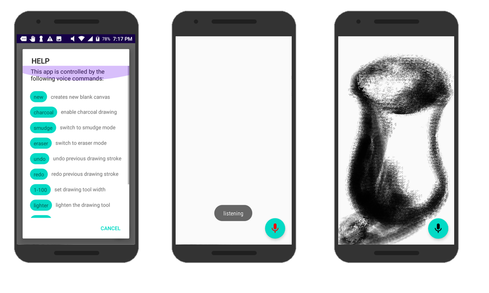

# Charcoal Drawing App

## About
The Charcoal Drawing App offers a set of tools specialized for charcoal drawing.
The app is controlled by voice commands, which allows for maximum drawing space on your screen.
Hone your drawing skills while bringing to life the incredible objects in the world around you.

## Significance of Charcoal
Pencils are convenient because most people have easy access to them. Paint is popular because the colors involved excite even young children. 
But when trying to depict an image in 3D, an artist focuses, not on the colors, but on the lights and darks of the image – the shadows and the highlights. 
It is the varying tones of lights and darks that can transform a flat, white canvas into a 3D image that appears to be protruding from the canvas’s surface.
Charcoal is the ideal tool for capturing the contrasting shades in the world because of its ability to render both extreme lights and extreme darks.

## Use the Command Line to control your device
[Android Debug Bridge](https://developer.android.com/studio/command-line/adb) (ADB) is a versatile command-line tool that lets you communicate with your device. ADB is included in the Android SDK Platform-Tools package. To use this tool, in the Android Studio terminal, navigate to the folder containing adb.exe. The default location is `%USERPROFILE%\AppData\Local\Android\sdk\platform-tools.` Then simply run one of the following commands.

Execute a voice command. Just replace "charcoal" with the command you want to execute.

`adb shell am broadcast -a android.intent.action.VOICE_COMMAND --es "command" "charcoal"`

Draw a point [x y]

`adb shell input tap 500 500`

Draw a line [x1 y1 x2 y2 milliseconds the swipe will take]

`adb shell input swipe 100 500 150 1450 100`

## Future Enhancements
* Pinch-to-zoom
* Image gallery within app
* Visual instructions for new users
